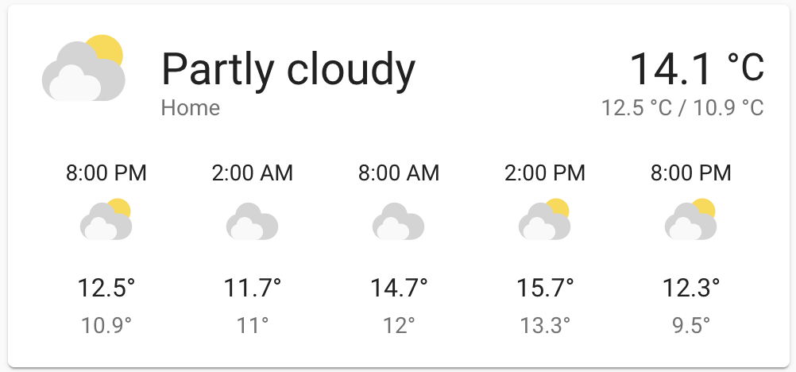
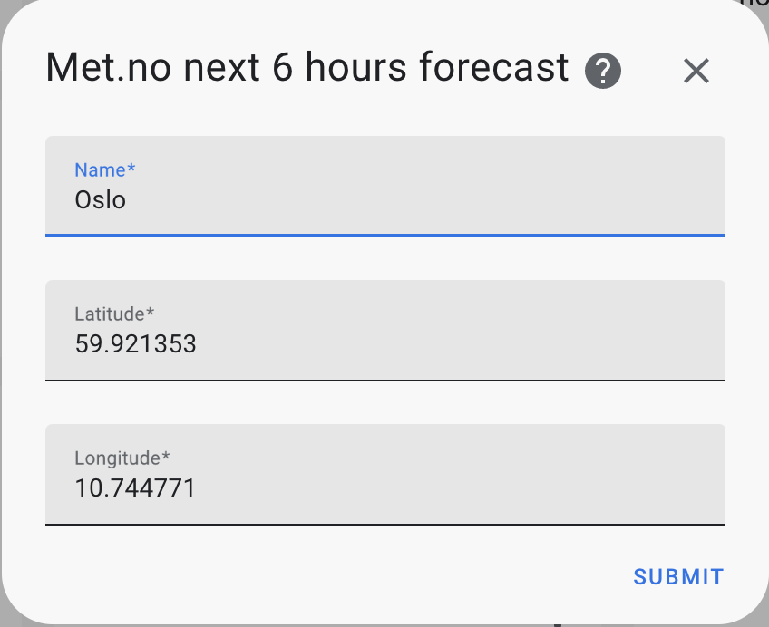

# Met.no next 6 hours forecast component for Home Assistant

This component will add a weather sensor with data from [met.no](https://www.met.no/), similay to the default [met.no](https://www.home-assistant.io/integrations/met/) component, but using the next 6 hours forecast data.

The weather forecast is delivered by the Norwegian Meteorological Institute and the NRK.

## Installation

- Ensure that [HACS](https://hacs.xyz/) is installed.
- In HACS / Integrations / menu / Custom repositories, add the url the this repository.
- Search for and install the 'Met.no next 6 hours forecast' integration.
- Restart Home Assistant.

## Configuration

Configuration of the integration is done through Configuration > Integrations where you enter coordinates. 

Enter the latitude and longitude as decimals for the selected location.

